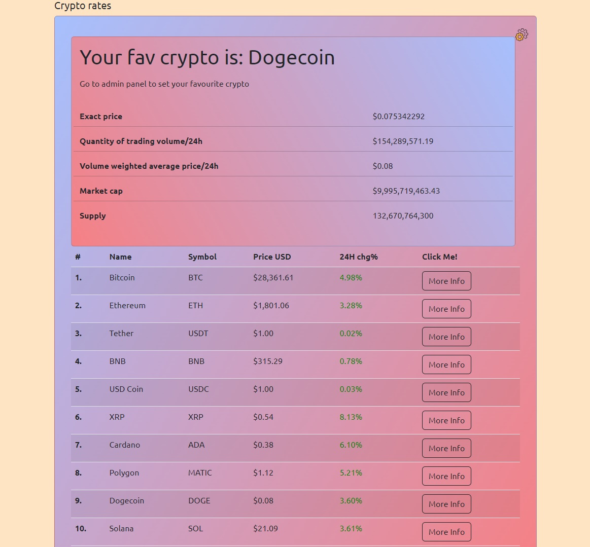

# Crypto Widget

This is my crypto widget displaying the current rates of varoius cryptos

## Table of contents

- [Overview](#overview)
  - [Screenshot](#screenshot)
  - [Links](#links)
- [My process](#my-process)
  - [Built with](#built-with)
  - [What I learned](#what-i-learned)
- [Author](#author)

## Overview

This is my crypto widget app created with Angular, TypeScript, Scss and Bootstrap. All the data is being pulled from an API

### Screenshot

### Links

- Live Site URL:

## My process

### Built with

- Angular
- TypeScript
- Bootstrap
- HTML5
- SCSS custom properties

### What I learned

I learned a lot during the creation of this project. Not only I got fimilliar with the basic concept of creating an Angular App but also how to use routing and reactive forms.

## Author

- LinkedIn - [Kamil Kaźmierczak](https://www.linkedin.com/in/kamil-ka%C5%BAmierczak-01aa83226/)
